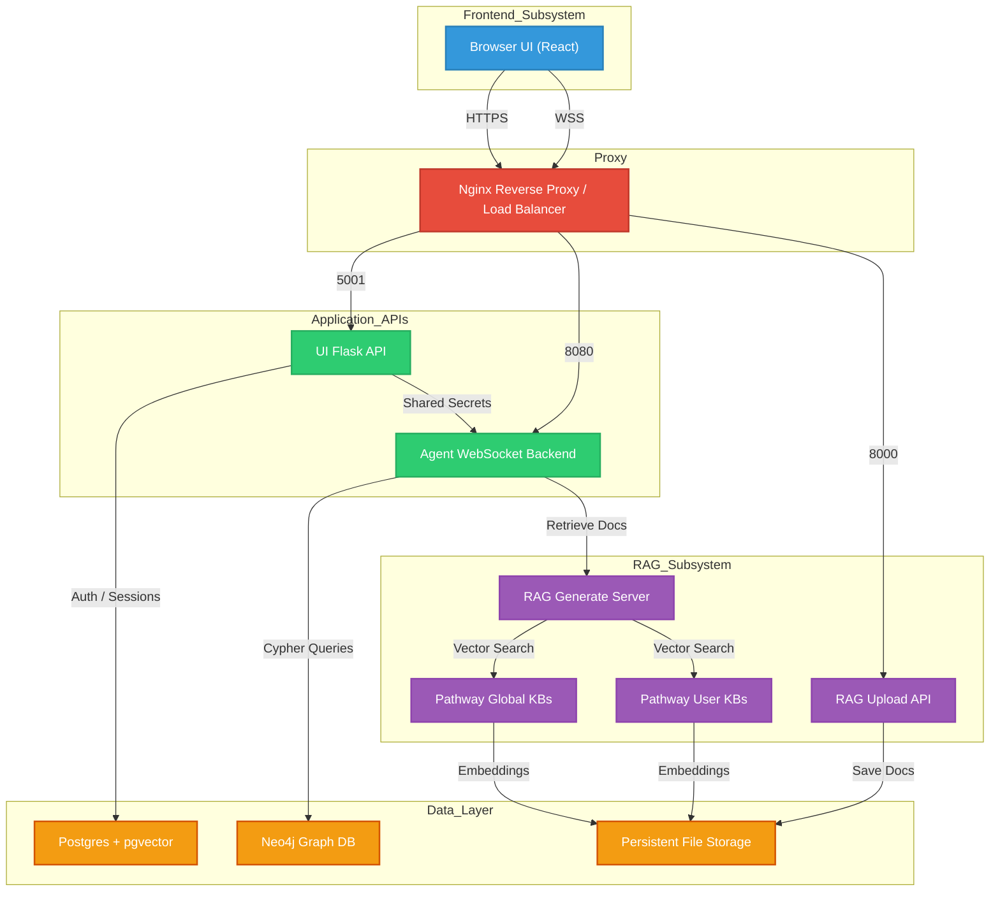

# Chat3GPP

A production-ready, highly sophisticated agentic pipeline designed specifically for advanced research, analysis, and querying of 3GPP telecommunications standards. The project operates via a multi-agent orchestrated WebSocket backend, a distributed RAG retrieval service, a secure Flask Auth layer, and a dynamic React/Vite web interface.

## Table of Contents
1. [Architecture Overview](#architecture-overview)
2. [Directory Structure](#directory-structure)
3. [Prerequisites](#prerequisites)
4. [Environment Variables](#environment-variables-configuration)
5. [Ports & Services Blueprint](#ports--services-blueprint)
6. [Installation & Setup](#installation--setup)
7. [Running the Application](#running-the-application)
8. [Debugging & Development Guide](#debugging--development-guide)
9. [Data Management & Backups](#data-management--backups)

---

## Architecture Overview

Chat3GPP utilizes a multi-layered ecosystem spanning stateless, memory-intensive, and persistent database layers. 

### System Architecture Diagram


---

## Agentic Execution Flow & Graph Mechanics

Chat3GPP models complex workflows dynamically as a Directed Acyclic Graph (DAG) before executing them. The entire intelligence layer relies on heavily orchestrated interaction between specialized sub-agents. 

### 1. Query Routing (`ClassifierAgent.py`)
A fast, lightweight intent-classifier determines if the user is asking a direct factual question or requesting deep multi-layered research. Factual questions bypass planning and directly query RAG stores for blazing-fast answers.

### 2. Execution Mapping (`PlannerAgent.py`)
When deep research is requested, the Planner breaks down the user’s broad intent into atomic, sequential, or parallel sub-tasks. It maps this intelligence out as a JSON Graph, which is instantly streamed over WebSockets to the React frontend to build the interactive UI tree.

### 3. Tree Search Reasoning (LATS)
At the core of complex execution lies the Language Agent Tree Search (`LATS`). When solving an atomic task, agents do not act linearly. Instead, they utilize Monte Carlo Tree Search methodologies:
- Propose multiple solution paths.
- Simulate tools (like Neo4j schema reads or RAG fetching).
- Backpropagate scores reflecting the validity of the information.
- Backtrack if a hallucination or dead-end is encountered.

### 4. Vector & Graph Retrieval Integration (`RAG_Agent.py` & `jina-reader`)
During LATS, sub-agents can fetch technical specifications deeply buried within zipped Word documents using robust internal Pipeline Tools. These include querying `Pathway`-backed live embeddings or reading relationship topologies directly out of `pgvector` and `Neo4j` databases.

### 5. Orchestration & Formatting (`Smack.py` & `DrafterAgent.py`)
`Smack.py` strictly adheres to the DAG constraints, preventing agents from acting before dependent nodes fulfill their objectives. Once every leaf in the decision tree resolves, the execution context is pooled and fed into the DrafterAgent to generate a heavily cited, authoritative final response in Markdown.

---

## Directory Structure

The project code is partitioned into 5 independent subsystems representing distinct architectural bounds:

- **`frontend/`**: The React/Vite-based client application. It manages local states, renders multi-agent execution graphs, plots technical diagrams, and parses KaTeX/markdown.
- **`backend/ui-api/`**: A stateless Python Flask service managing chat history persistence, user authentication (via JSON Web Tokens, Google OAuth, Local Login), and analytical feedback loops.
- **`backend/ws-service/`** & **`pipeline/`**: The dynamic agentic engine. The `ws-service/` exposes WebSocket paths managing parallel orchestration. `pipeline/` holds definitions of Agents (Planner, Drafter, Classifier, RAG), Language Agent Tree Search mechanisms (LATS), guardrails, and Jina AI integration.
- **`rag/`**: Standalone document ingestion, vectorization, and retrieval pipeline powered by multiple tools. Uses `Pathway` for in-memory and embedded document operations.
- **`data/`**: (Generated) Persistent directories like `neo4j-backups/` where database extracts are safely mounted out of live containers.

---

## Prerequisites

Before setting up the environment, ensure your host has the following utilities installed:

- **OS**: Linux / Ubuntu 22.04+ Recommended.
- **Docker & Docker Compose**: For deploying Postgres, pgvector, and Adminer instances.
- **Node.js (v18+)**: For building the frontend UI.
- **Miniconda / Anaconda**: For securely managing Python isolation per service.
- **PM2**: `npm install pm2 -g` as the unified process manager for all backend services.
- **Neo4j**: Accessible standard Neo4j server (via Docker or native).

---

## Environment Variables Configuration

Sensitive configurations, API keys, and endpoint definitions are managed via `.env` files located inside each subsystem root. Be extremely careful not to commit these to version control.

### 1. Pipeline & WebSocket Service (`backend/ws-service/.env` and `pipeline/.env`)
*This service acts as the orchestrator.*

| Variable | Description | Example / Default |
|----------|-------------|-------------------|
| `LLM_PROVIDER` | Core model provider logic (`openai` or `deepseek`) | `deepseek` |
| `LLM_MODEL` | The foundation reasoning model id | `deepseek-chat` |
| `DEEPSEEK_API_KEY` | Secret key for DeepSeek | `sk-...` |
| `NEO4J_URI` | Bolt connection URI to the Graph Store | `bolt://localhost:7687` |
| `NEO4J_USER` | Admin username | `neo4j` |
| `NEO4J_PASSWORD` | Admin password | `login123` |
| `POSTGRES_HOST`, `*_PORT`, `*_DB` | PG credentials matching `docker-compose.yml` | `localhost`, `5432`, `postgres` |
| `POSTGRES_USER`, `*_PASSWORD`  | PG user/password | `udbhav`, `login123` |
| `RAG_GENERATE_URL` | Route pointing to internal rag-server | `http://localhost:4005/generate` |
| `RAG_RETRIEVE_URL` | Global Pathway Retrieve API | `http://localhost:4004/v1/retrieve` |
| `RAG_USER_RETRIEVE_URL` | Personal/User Private Pathway API | `http://localhost:4006/v1/retrieve` |
| `JWT_SECRET` | Must identical across `rag`, `ui-api`, `ws-service`| `eval-secret-123` |
| `JWT_ALGORITHM` | Hashing algo | `HS256` |
| `WRITE_ARTIFACTS` | Boolean; determines if agent debugs save | `false` |
| `LANGCHAIN_VERBOSE` | Debug boolean for chains | `false` |

### 2. UI Flask API (`backend/ui-api/.env`)
*Authentication and history database configurations.*

| Variable | Description | Example / Default |
|----------|-------------|-------------------|
| `VITE_API_BASE_URL` | Base url routing HTTP | `https://wisdomlab3gpp.live` |
| `VITE_UPLOAD_BASE_URL` | Base url routing Uploads | `https://wisdomlab3gpp.live` |
| `VITE_WS_BASE_URL` | Base url routing WebSockets | `wss://wisdomlab3gpp.live/ws` |
| `JWT_SECRET` | Secret identical to other services | `abracadabraabracadabra` |
| `SECRET_KEY` | Flask session key | `abracadabra` |
| `JWT_EXP_MINUTES` | Lifecycle of issued token | `10080` (7 Days) |
| `AUTH_DB_PATH` | Path to auth SQlite store | `auth.db` |
| `GOOGLE_CLIENT_ID`, `*_SECRET` | OAuth keys for Google Login | `[Provided by GCP]` |
| `SMTP_HOST`, `*_USER`, `*_PASS`| Mailer for recovery/alerts | `smtp.gmail.com`, `user@gmail.com` |

### 3. RAG Retrieval (`rag/.env`)
*Large Language Model access keys primarily focused on Embeddings and Generation phases.*

| Variable | Description | Example / Default |
|----------|-------------|-------------------|
| `DEEPSEEK_API_KEY` | Embedded Generator model credentials | `sk-...` |
| `OPENAI_API_KEY` | Fallback Generation access | `sk-...` |
| `VOYAGE_API_KEY` | Embeddings model access key | `pa-...` |
| `RAG_RERANK_ENABLED` | Toggle for Cohere/similarity rerankers | `false` |

### 4. Frontend Client (`frontend/.env`)
*Compiled into the final React dist code. Do NOT store private API Keys here.*

| Variable | Description | Example / Default |
|----------|-------------|-------------------|
| `VITE_API_BASE_URL` | Proxy pointing to `ui-api` (Port 5001) | `https://wisdomlab3gpp.live` |
| `VITE_UPLOAD_BASE_URL` | Proxy pointing to `rag/http_serve` | `https://wisdomlab3gpp.live` |
| `VITE_WS_BASE_URL` | Proxy pointing to `ws-service` (Port 8080)| `wss://wisdomlab3gpp.live/ws` |

---

## Ports & Services Blueprint

In production or local environments, avoid service collisions. Here are the reserved ports per logical component:

| Port | Protocol | Subsystem Name | Script Executor | Role Profile |
|------|----------|----------------|-----------------|--------------|
| `8080` | `WSS / WS` | Agent WebSocket Backend | `backend/ws-service/main.py` | Receives client user queries, computes DAG graphs, runs multi-agents |
| `8000` | `HTTP` | RAG HTTP Servicer | `rag/http_serve.py` | Upload, Read, and File Administration API |
| `4004` | `HTTP` | Global Pathway Store | `rag/pw_new.py` | Massive vector retrieval database endpoint |
| `4006` | `HTTP` | User Pathway Store | `rag/pw_userkb.py` | Segmented private knowledge bases per user |
| `4005` | `HTTP` | RAG Generation | `rag/rag_server.py` | Assembles final semantic prompts |
| `5001` | `HTTP` | UI Flask API | `backend/ui-api/app.py` | Chat history, Authentication states & User endpoints |
| `5432` | `TCP` | PostgreSQL (Docker) | `docker-compose.yml` | PGVector Store representing pipeline state/graphs |
| `5433` | `HTTP` | Adminer (Docker) | `docker-compose.yml` | Web GUI mapped to Postgres |
| `5173` | `HTTP` | Frontend Dev Server | `vite start` | Local Dev Live-Reload UI Engine |

---

## Installation & Setup

1. **Clone the repository:**
   ```bash
   git clone <repo-url> Chat3GPP
   cd Chat3GPP
   ```

2. **Initialize Anaconda Environment:**
   Create an environment capable of running LLM Tooling. Ensure you point PM2 (`pm2.config.js`) to this conda prefix path!
   ```bash
   conda create -n chat3gpp-clean python=3.10 -y
   conda activate chat3gpp-clean
   ```

3. **Install Python backend requirements:**
   Install dependencies specific to each component:
   ```bash
   pip install -r backend/ws-service/requirements.txt
   pip install -r backend/ui-api/requirements.txt
   pip install -r rag/requirements.txt
   ```

4. **Install Node Frontend dependencies:**
   ```bash
   cd frontend
   npm install
   ```

---

## Running the Application

### 1. Launch the Databases (PostgreSQL)
From the root of `Chat3GPP`:
```bash
docker-compose up -d
```
*(Verify it's running via `docker ps`, Postgres maps strictly to `<host>:5432`)*

### 2. Configure Pathway & Neo4j Data Folders
Ensure these folders exist securely on your host:
- `rag/uploads`
- `rag/user_uploads`

### 3. Start Backend Services with PM2
There is a unified config named `pm2.config.js` tracking Node and Python workers. Ensure the `condaPrefix` inside the file reflects your system's python path.
```bash
# Execute from root:
pm2 start pm2.config.js
# Save state to launch on server boot:
pm2 save
# Monitor the live states:
pm2 monit
```

### 4. Start the Development Frontend (Or Build Production)
For local development:
```bash
cd frontend
npm run dev
```
For Production (Nginx):
```bash
# Within the frontend directory
npm run build
## Serve the `dist/` folder statically via Nginx on port 80/443 pointing to `/`
```

---

## Debugging & Development Guide

If endpoints are unreachable or the pipeline hangs, observe the following patterns:

1. **Agent Execution Issues:** 
   The pipeline aggressively logs steps into `backend/ws-service/ProcessLogs.md`. Read this dynamically via `tail -f ProcessLogs.md` when the graph seems stuck.
2. **Postgres Connectivity Errors:**
   Open a browser to `localhost:5433` using the Adminer docker image. Input your postgres user (`udbhav`) and verify the connections.
3. **API Keys Rejecting Models:**
   Monitor `pm2 logs`. If `DEEPSEEK_API_KEY` restricts input tokens, `agent-ws` instances might rapidly retry and fail.
4. **Changing Core Framework Rules (LATS):**
   Navigate to `/pipeline/Agents/LATS`. Adjust the Tree Search algorithms when needing higher precision or recall across node selection.

---

## Data Management & Backups

- **Neo4j Offline Backups:** Never manually zip the active database. Always execute online backups using `neo4j-admin backup --backup-dir data/neo4j-backups --database neo4j`.
- **User Uploads (RAG):** RAG embeds directly out of directories at `rag/user_uploads`. Backup this flat-file directory concurrently with `postgres` to ensure embeddings sync properly on restore.

---

